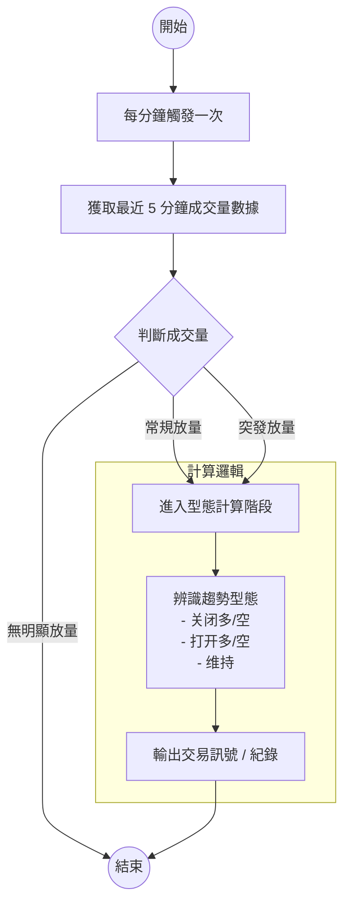

# 预测行情26w12

## 整體開發流程
- 文檔: [预测行情 26w12](https://app.diagrams.net/#G1ZmvZXvzC0xl2Pf3yAkwGwaK0erOITNOK#%7B%22pageId%22%3A%226EYssyOfNNX0cxHdKopl%22%7D)

## 🧩模塊
### 📈有大量且超長赹勢產品

### 📊放量時間計算
#### 常規放量時間計算
| 時段 | 時間範圍 |
| --- | --- |
| 亚洲市场放量时间 | 0900-1030 |
| 欧洲放量时间 | 1400-1600 |
| 美国放量时间 | 2130-2330 |

#### 突發放量檢測
- 全部结构放量 级别7和8
- 移动窗口穿越 20天量的比值高
- 產品：当前时区的所有股和商品

## 唔知有冇用的資料
### 4個時間段
| 時段 | 時間範圍 |
| --- | --- |
| CME 時間  | 0600 - 9030 |
| ASIA 時間 | 9030 - 1500/1600 ? | 
| EU 時間   | 1500 - 2100 |
| US 時間   | 2100 - 0600 |

### 常規放量時間
| 時段 | 時間範圍 |
| --- | --- |
| 亚洲市场放量时间 | 0900-1030 |
| 欧洲放量时间 | 1400-1600 |
| 美国放量时间 | 2130-2330 |

## 參考圖

